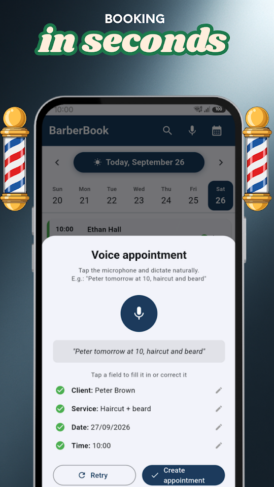
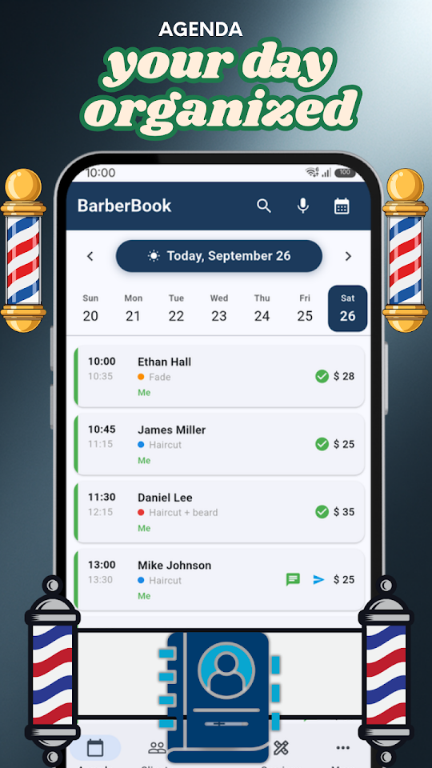
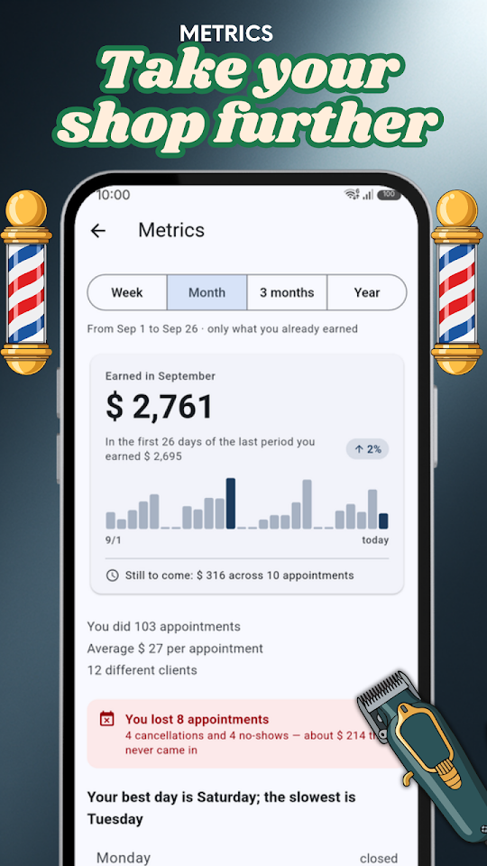
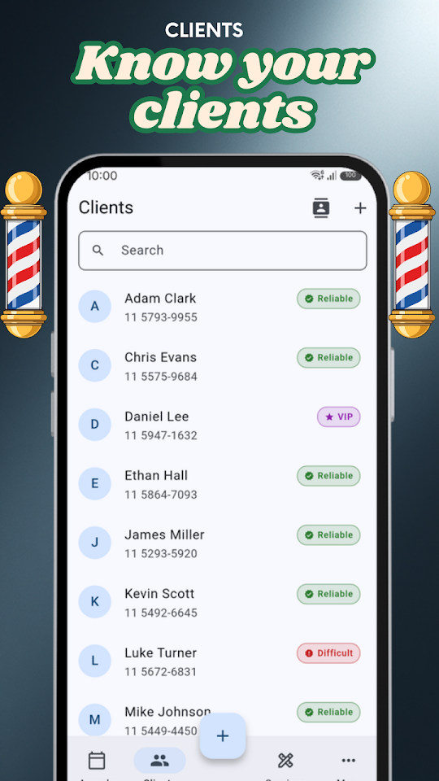

  
  <h1>BarberBook - Barber Agenda</h1>
  
<b>Appointment book for barbers. Clients, reminders & metrics.</b>

  

  
<a href="README.md">🇦🇷 Español</a> · 🇺🇸 English · <a href="README-pt.md">🇧🇷 Português</a> · <a href="README-it.md">🇮🇹 Italiano</a>

  
  
  
  

Built for barbers and hairdressers who want to stay organized without the hassle. Manage appointments, know your clients, and run your business from your phone.

## 📅 SMART SCHEDULING

See all your appointments at a glance. Swipe to change days, tap for details, reschedule or cancel individually or in bulk.

## 🎙️ VOICE BOOKING

Book by speaking: "Pedro tomorrow at 10 haircut and beard trim". BarberBook understands the name, date, time, and service automatically.

## 💬 WHATSAPP REMINDERS

Send reminders with a single tap. Customize templates with client name, service, date, and time.

## 🔔 NEXT-DAY ALERT

Every night you receive a notification with tomorrow's appointments so you can prepare ahead.

## 👥 CLIENT PROFILES

Each client has their visit history, internal notes, and rating (VIP, reliable, problematic). Import contacts from your phone in one tap.

## 📊 BUSINESS METRICS

Revenue charts, most requested services, top clients, and comparison with previous periods. Filter by week, month, quarter, or year.

## 🔒 YOUR DATA ON YOUR PHONE

Your agenda is stored only on your phone, with no external servers and no sign-up. It is never shared with anyone.

## FREE — WITH ADS

- Unlimited appointments
- Up to 50 clients, 15 services and 3 barbers
- Voice booking & WhatsApp reminders
- Client profiles with history and rating
- Revenue & service metrics
- Next-day appointment alert

## ⭐ BARBERBOOK PRO

No ads. Unlimited clients, services and barbers on your team, plus a backup you can carry to another phone. 7 days free; cancel anytime from Google Play.

Developed by EgeaINC — Gabriel Egea.

---

## 📋 What's new

Every change, version by version: [CHANGELOG](CHANGELOG-en.md).

## 💬 Feedback and issues

Found a bug or have an idea? Open an [issue](https://github.com/gabriel600r/barberbook-feedback/issues/new) or write to us from the app (More → Send feedback or report).

## 🔒 Privacy

Your agenda is stored only on your phone. The free version shows Google AdMob ads; PRO removes them. Details in the [privacy policy](PRIVACY_POLICY.md).
