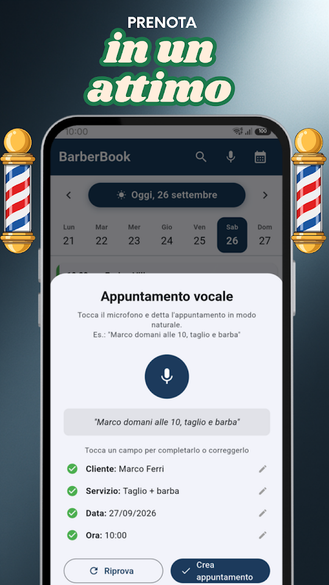
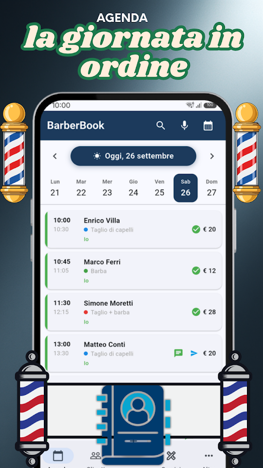
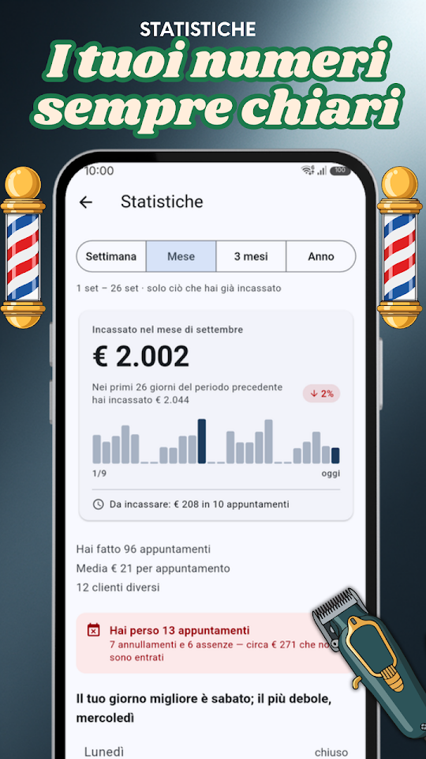
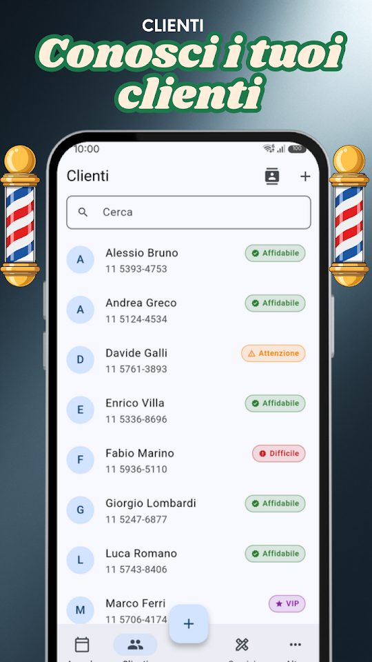

  
  <h1>BarberBook - Agenda Barbiere</h1>
  
<b>🇮🇹 Agenda appuntamenti per barbieri. Clienti, promemoria e metriche.</b>

  

  
<a href="README.md">🇦🇷 Español</a> · <a href="README-en.md">🇺🇸 English</a> · <a href="README-pt.md">🇧🇷 Português</a> · 🇮🇹 Italiano

  
  
  
  

Pensata per barbieri e parrucchieri che vogliono organizzarsi senza complicazioni. Gestisci gli appuntamenti, conosci i tuoi clienti e controlla il tuo business dallo smartphone.

## 📅 AGENDA INTELLIGENTE

Visualizza tutti gli appuntamenti del giorno in un colpo d'occhio. Scorri per cambiare giorno, tocca per i dettagli, riprogramma o cancella individualmente o in blocco. Aggiungi più servizi allo stesso appuntamento: durata e prezzo si sommano da soli.

## 🎙️ APPUNTAMENTI CON LA VOCE

Prenota parlando: "Pedro domani alle 10 taglio e barba". BarberBook capisce nome, data, ora e servizio automaticamente.

## 📲 RICHIESTE SU WHATSAPP

Condividi il tuo link o il tuo codice QR perché i clienti ti chiedano un appuntamento su WhatsApp, con il messaggio già scritto. E invia gli orari che hai ancora liberi, pronti con un tocco.

## 💬 PROMEMORIA VIA WHATSAPP

Invia promemoria con un solo tocco. Personalizza i modelli con nome del cliente, servizio, data e ora.

## 🔔 AVVISO DEL GIORNO SUCCESSIVO

Ogni sera ricevi una notifica con gli appuntamenti del giorno dopo per poterti preparare.

## 👥 SCHEDA CLIENTI

Ogni cliente ha il suo storico visite, note interne e classificazione (VIP, affidabile, problematico). Importa contatti dal telefono con un tocco.

## 📊 METRICHE DEL TUO BUSINESS

Grafici di guadagni, servizi più richiesti, migliori clienti e confronto con periodi precedenti. Filtra per settimana, mese, trimestre o anno.

## 🔒 I TUOI DATI NEL TUO TELEFONO

La tua agenda resta solo nel telefono, senza server esterni né registrazione. Non viene mai condivisa con nessuno.

## 🇮🇹 DISPONIBILE IN ITALIANO

BarberBook è completamente in italiano — interfaccia, notifiche, promemoria e ogni funzione. Pensata per il mercato italiano, parla la tua lingua.

## GRATUITO — CON PUBBLICITÀ

- Appuntamenti illimitati
- Fino a 50 clienti, 15 servizi e 3 barbieri
- Appuntamenti vocali e promemoria WhatsApp
- Link e QR per ricevere richieste su WhatsApp, e orari liberi pronti da inviare
- Scheda clienti con storico e classificazione
- Metriche di guadagni e servizi
- Avviso notturno del giorno successivo

## ⭐ BARBERBOOK PRO

Senza pubblicità. Clienti, servizi e barbieri del team senza limite, più il backup per portare tutto su un altro telefono. 7 giorni gratis; annulli quando vuoi da Google Play.

Sviluppato da EgeaINC — Gabriel Egea.

---

## 📋 Novità

Tutto ciò che è cambiato, versione per versione: [CHANGELOG](CHANGELOG-it.md).

## 💬 Suggerimenti e problemi

Hai trovato un errore o hai un'idea? Apri una [issue](https://github.com/gabriel600r/barberbook-feedback/issues/new) o scrivici dall'app (Altro → Invia suggerimento o segnalazione).

## 🔒 Privacy

La tua agenda resta solo nel telefono. La versione gratuita mostra annunci Google AdMob; PRO li toglie. Dettagli nell'[informativa sulla privacy](PRIVACY_POLICY.md).
