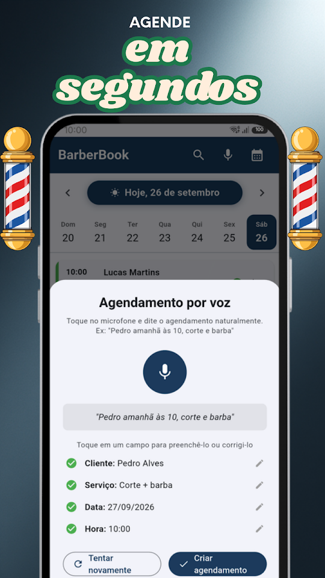
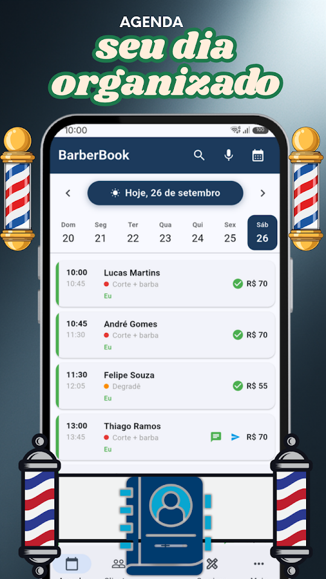
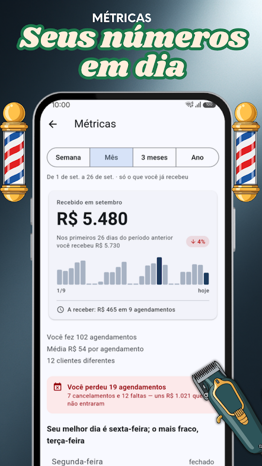
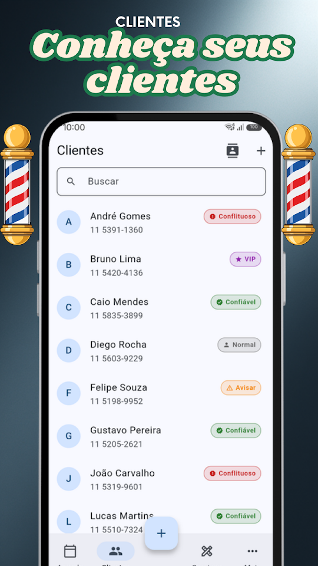

  
  <h1>BarberBook - Agenda Barbearia</h1>
  
<b>🇧🇷 Agenda de horários para barbeiros — em português!</b>

  

  
<a href="README.md">🇦🇷 Español</a> · <a href="README-en.md">🇺🇸 English</a> · 🇧🇷 Português · <a href="README-it.md">🇮🇹 Italiano</a>

  
  
  
  

Feita para barbeiros e cabeleireiros que querem se organizar sem complicações. Gerencie seus horários, conheça seus clientes e controle seu negócio pelo celular.

## 📅 AGENDA INTELIGENTE

Veja todos os horários do dia de uma vez. Deslize para mudar de dia, toque para ver os detalhes, reagende ou cancele horários individualmente ou em lote.

## 🎙️ AGENDAMENTO POR VOZ

Agende falando: "Pedro amanhã às 10 corte e barba". O BarberBook entende o nome, a data, o horário e o serviço automaticamente.

## 💬 LEMBRETES PELO WHATSAPP

Envie lembretes com um único toque. Personalize os modelos com nome do cliente, serviço, data e hora.

## 🔔 AVISO DO DIA SEGUINTE

Toda noite você recebe uma notificação com os horários do dia seguinte para se preparar.

## 👥 FICHA DE CLIENTES

Cada cliente tem seu histórico de visitas, notas internas e classificação (VIP, confiável, problemático). Importe contatos do telefone com um toque.

## 📊 MÉTRICAS DO SEU NEGÓCIO

Gráficos de receita, serviços mais pedidos, melhores clientes e comparação com períodos anteriores. Filtre por semana, mês, trimestre ou ano.

## 🔒 SEUS DADOS NO SEU TELEFONE

Sua agenda fica só no seu telefone, sem servidores externos e sem cadastro. Nunca é compartilhada com ninguém.

## GRATUITO — COM ANÚNCIOS

- Agendamentos ilimitados
- Até 50 clientes, 15 serviços e 3 barbeiros
- Agendamento por voz e lembretes WhatsApp
- Ficha de clientes com histórico e classificação
- Métricas de receita e serviços
- Aviso noturno do dia seguinte

## ⭐ BARBERBOOK PRO

Sem anúncios. Clientes, serviços e barbeiros da equipe sem limite, além de backup para levar tudo para outro celular. 7 dias grátis; cancele quando quiser no Google Play.

Desenvolvido por EgeaINC — Gabriel Egea.

## 🇧🇷 APP 100% EM PORTUGUÊS DO BRASIL

O BarberBook foi totalmente traduzido para o português do Brasil. Interface, notificações, lembretes e suporte — tudo no seu idioma.

---

## 📋 Novidades

Tudo o que mudou, versão por versão: [CHANGELOG](CHANGELOG-pt.md).

## 💬 Sugestões e problemas

Encontrou um erro ou tem uma ideia? Abra uma [issue](https://github.com/gabriel600r/barberbook-feedback/issues/new) ou escreva pelo app (Mais → Enviar sugestão ou reporte).

## 🔒 Privacidade

Sua agenda fica só no seu telefone. A versão grátis mostra anúncios do Google AdMob; o PRO tira os anúncios. Detalhes na [política de privacidade](PRIVACY_POLICY.md).
