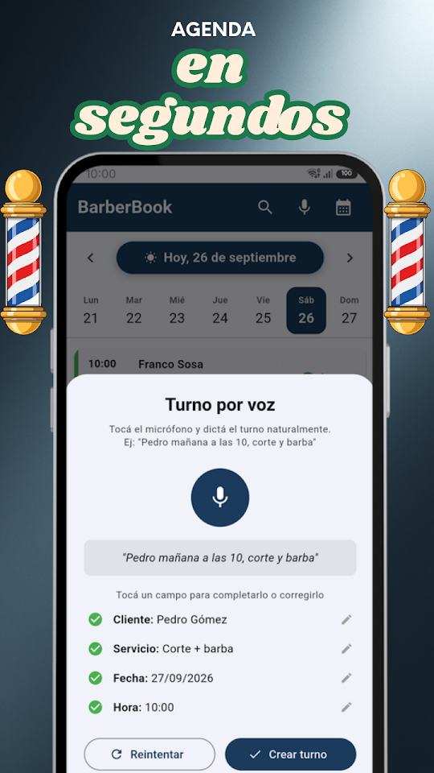
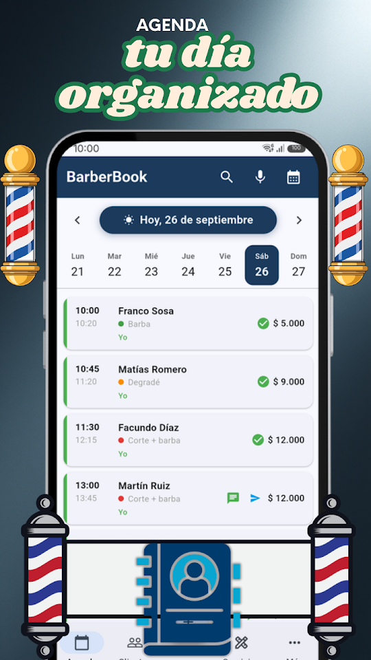
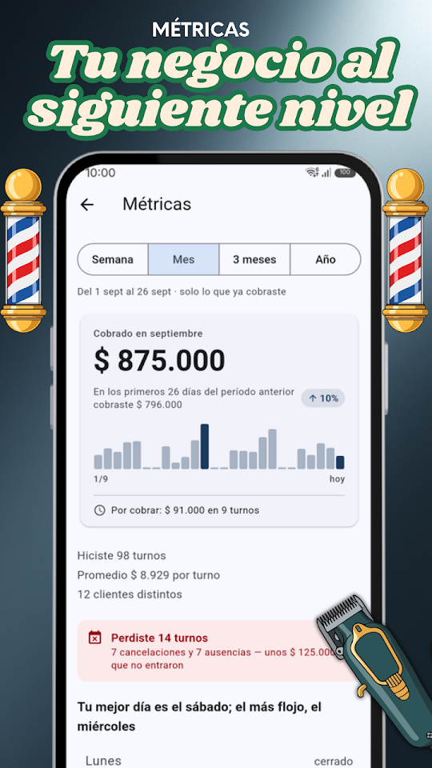
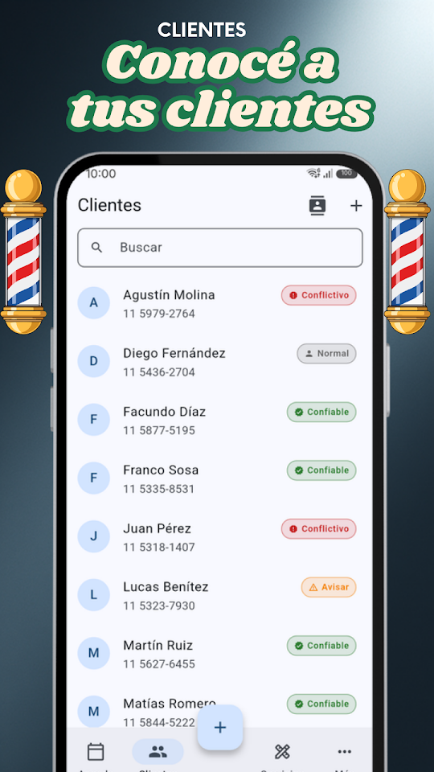

  
  <h1>BarberBook - Agenda Barbería</h1>
  
<b>Agenda de turnos para barberos. Turnos, clientes, recordatorios y métricas.</b>

  

  
🇦🇷 Español · <a href="README-en.md">🇺🇸 English</a> · <a href="README-pt.md">🇧🇷 Português</a> · <a href="README-it.md">🇮🇹 Italiano</a>

  
  
  
  

Pensada para barberos y peluqueros que quieren organizarse sin complicaciones. Gestioná tus turnos, conocé a tus clientes y controlá tu negocio desde el celular.

## 📅 AGENDA INTELIGENTE

Visualizá todos tus turnos del día de un vistazo. Deslizá para cambiar de día, tocá para ver los detalles, reprogramá o cancelá turnos de forma individual o en lote. Sumá varios servicios en un mismo turno: el tiempo y el precio se suman solos.

## 🎙️ TURNOS POR VOZ

Cargá turnos hablando. Decí "Pedro mañana a las 10 corte y barba" y BarberBook lo interpreta automáticamente. Ideal para cuando tenés las manos ocupadas.

## 📲 TURNOS POR WHATSAPP

Compartí tu enlace o tu código QR para que tus clientes te pidan turno por WhatsApp, con el mensaje ya escrito. Y mandales los horarios que te quedan libres, armados con un toque.

## 💬 RECORDATORIOS POR WHATSAPP

Mandá recordatorios con un solo toque. Personalizá las plantillas con nombre del cliente, servicio, fecha y hora.

## 🔔 AVISO DEL DÍA SIGUIENTE

Todas las noches recibís una notificación con los turnos del día siguiente para que puedas prepararte.

## 👥 FICHA DE CLIENTES

Cada cliente tiene su historial de visitas, notas internas y clasificación (VIP, confiable, conflictivo). Importá contactos desde tu teléfono con un toque.

## 📊 MÉTRICAS DE TU NEGOCIO

Gráficos de ingresos, servicios más pedidos, mejores clientes y comparación con períodos anteriores. Filtrá por semana, mes, trimestre o año.

## 🔒 TUS DATOS EN TU TELÉFONO

Tu agenda se guarda sólo en tu teléfono, sin servidores externos ni registro. Nunca se comparte con nadie.

## GRATIS — CON PUBLICIDAD

- Turnos ilimitados
- Hasta 50 clientes, 15 servicios y 3 barberos
- Turnos por voz y recordatorios WhatsApp
- Enlace y QR para pedir turno por WhatsApp, y horarios libres listos para mandar
- Ficha de clientes con historial y clasificación
- Métricas de ingresos y servicios
- Aviso nocturno del día siguiente

## ⭐ BARBERBOOK PRO

Sin publicidad. Clientes, servicios y barberos del equipo sin límite, más copia de seguridad para llevarte todo a otro teléfono. 7 días gratis; cancelás cuando quieras desde Google Play.

Desarrollada por EgeaINC — Gabriel Egea.

---

## 📋 Novedades

Todo lo que cambió, versión por versión: [CHANGELOG](CHANGELOG.md).

## 💬 Sugerencias y problemas

¿Encontraste un error o tenés una idea? Abrí un [issue](https://github.com/gabriel600r/barberbook-feedback/issues/new) o escribinos desde la app (Más → Enviar sugerencia o reporte).

## 🔒 Privacidad

Tu agenda se guarda sólo en tu teléfono. La versión gratis muestra publicidad de Google AdMob; PRO la saca. Detalles en la [política de privacidad](PRIVACY_POLICY.md).
